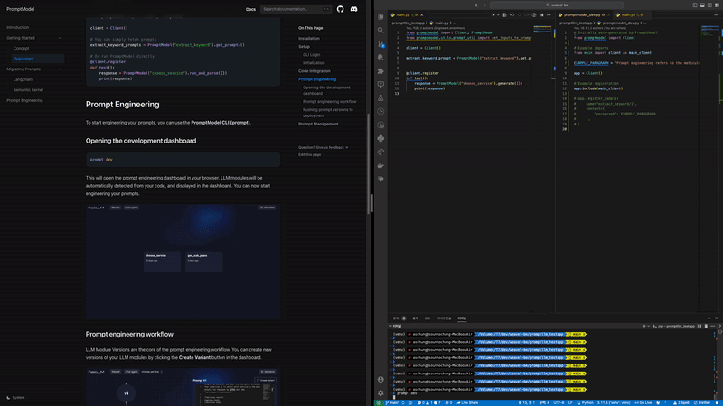
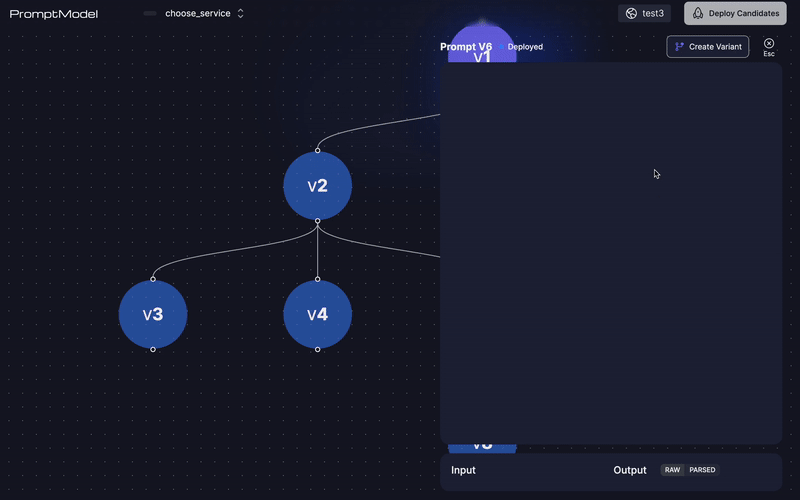
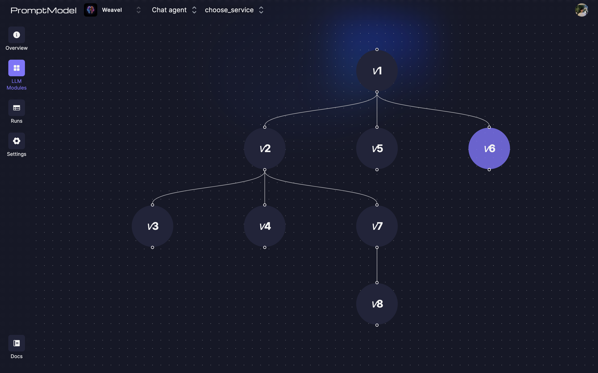
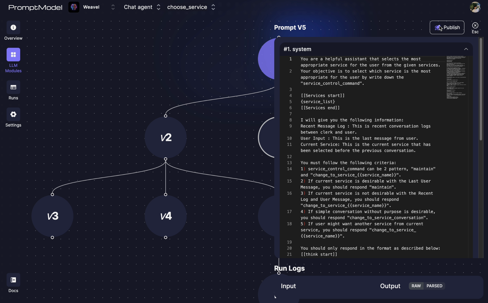

import { Callout } from 'nextra/components'
import { TutorialVideoLoom } from '@/components/videos/TutorialVideo'

# Quickstart (from your IDE) 🚀

Integrate **Promptmodel**'s development dashboard into your codebase in less than 5 minutes.

> We are currently in closed alpha. If you would like to try out Promptmodel, visit [here](https://app.promptmodel.run).
> You can also request a personal demo [here](./schedule-demo.mdx).

## Video Tutorial (4-min)

<TutorialVideoLoom src="https://www.loom.com/embed/d0051bc0afc94860aebfbaca1bcb9c2f?sid=b7e55bb6-7f9b-4390-bb32-d567e8510358" />

## Installation

To install `promptmodel` run:

```bash copy
pip install promptmodel
```

## Setup

### Add your API key

First, you should add your API key to your environment variables. You can get your project's API key in the Project Settings page.  
Copy your project API key and add it to your environment variables.
{/*  */}

```bash filename=".env"
PROMPTMODEL_API_KEY=YOUR_API_KEY
```

### CLI Login

```bash
prompt login
```

You will be redirected to the Promptmodel website for CLI login. After logging in, you can close the browser window and return to your IDE.

{/*  */}

### Initialization

```bash
prompt init
```

This command will generate the following file in the current directory. This file will be used as an entry point for the prompt engineering dashboard.

```python filename="promptmodel_dev.py"
"""This single file is needed to build the DevApp development dashboard."""

from promptmodel import DevApp

# Example imports
# from <dirname> import < objectname>

app = DevApp()

# Example usage
# This is needed to integrate your codebase with the prompt engineering dashboard
# app.include_client(< objectname>)

```

Now you can open the development dashboard by running `prompt dev` command.

```bash
prompt dev
```

{/*  */}

## Code Integration

You can connect with your codebase with the development dashboard by simply adding a `DevClient` instance in your code and including it to your `DevApp`.

```python filename="your_code.py"
from promptmodel import DevClient

client = DevClient() # DevClient works as a bridge between your code and Web Prompt Editor
```

```python filename="promptmodel_dev.py"
...
from your_code import client as client_1

app = DevApp()

app.include_client(client_1) # with this, our DevApp (Web Prompt Editor) can read your code in real-time
...
```

Now our web editor is connected your code and synchronized in real-time.

> We make this possible by utilizing a **websocket connection**. Your private data and codebase is **NOT** saved in our server.

{/*  */}

If you use `PromptModel`, `ChatModel` or `ChatAgent` in your code, you should add a `DevClient` object in that file so that they will be automatically detected and displayed in the dashboard.

If they are used inside a function, you must wrap the function with `@client.register` decorator.

```python filename="your_code.py"
from promptmodel import DevClient, PromptModel

client = DevClient()

# You can simply fetch published prompts from the cloud
extract_keyword_prompts = PromptModel("extract_keyword").get_prompts()

# Or run PromptModel directly
@client.register
def test():
    response = PromptModel("choose_service").run_and_parse({})
    print(response.parsed_outputs)
    # Example ouptut : {"service_name" : "make_account", "arguments" : "[name, email, password]"}
```

The development dashboard will automatically detect your code changes and show `PromptModel` instances in the dashboard.  
Now you can easily add PromptModels in your IDE, and write prompts for them on our web editor without any additional work.

> While working on the codebase-connected development dashboard, we save your prompts in your local sqlite3 database.  
> You can deploy your best prompts onto the cloud at a later step.  
> You don't need to add your prompts in your code or as `txt` files anymore.



## Prompt Engineering

In this tutorial, we will walk you through the basic usage of our service with `PromptModel`.

> If you are interested in `ChatModel` (for chatbot) or `ChatAgent` (for custom agent),  
> please check [Chatmodel Editor](/docs/webpage/development_dashboard/chatmodel) or [ChatAgent Editor](/docs/webpage/development_dashboard/chatagent) page.

### Crafting your first prompt

Write and run your first prompt in the dashboard. You can view the output from the panel below.


#### I/O variables syntax

Placeholder for **inputs** can be defined just like writing a python f-string; by using curly braces `{}`.

```txt
Extract keywords from given passage:
{passage}
```

We provide parsing and automatic type conversion for LLM outputs. Currently supported parsing types are:

- Square brackets
- Double square brackets
- Html

Here is an example format for double square brackets:

```txt
[[variable type=str]]
output value here will be parsed correctly
[[variable]]
```

More output formats will be supported very soon. Synatx highlighting for prompts is also coming soon.

#### Add Input samples

You can add input samples for running your prompt in your code.
Any data you add in `promptmodel_dev.py` can be used in the dashboard.

```python filename="promptmodel_dev.py"

app.register_sample(
    name="extract_keyword/AIAYN",
    content={"passage": "The dominant sequence transduction models are based on..."},
)
```

{/*  */}

#### Function Call

You can also add functions for running your code.
If you want to add functions, you need 2 things; `FunctionSchema` and `Callable`(function).

```python filename="your_code.py"

def get_current_weather(location: str, unit: Optional[str] = None):
    return "13 degrees celsius"


get_current_weather_desc = {
    "name": "get_current_weather",
    "description": "Get the current weather in a given location",
    "parameters": {
        "type": "object",
        "properties": {
            "location": {
                "type": "string",
                "description": "The city and state, e.g. San Francisco, CA",
            },
            "unit": {"type": "string", "enum": ["celsius", "fahrenheit"]},
        },
        "required": ["location"],
    },
}
```

```python filename="promptmodel_dev.py"
from your_code import get_current_weather, get_current_weather_desc
app.register_function(get_current_weather_desc, get_current_weather)
```

When LLM call functions, function call and LLM rerun will be automatically processed.

{/*  */}

### Prompt engineering workflow

You can create new versions of your promptmodels by clicking the **Create Variant** button in the dashboard.



You can view differences with the previous version while writing your new version, which is a great way to keep track of your changes.

A new prompt version is created every time you click the **Run** button in the dashboard. Each version is automatically categorized into either `broken` or `working`, depending on whether the run was successful or not. You can evaulate the output, then update the category of the best prompt versions to `candidate`.

### Pushing prompt versions to deployment

Once you have at least one candidate prompt version, you can push the candidates to deployment by clicking the **Push to deployment** button in the dashboard. This will upload the candidate versions to the cloud, and make them available for use in deployment.

You can view and manage your deployed prompt versions in the deployment dashboard.



LLM token usage, latency, costs will be tracked for each promptmodel run. You can view these metrics in the deployment dashboard. _(coming soon)_

<Callout type="info" emoji="✨">
  Metric visualization & analytics based on human & LLM evaluation is also
  coming soon.
</Callout>

## Prompt Management

You can use the deployment dashboard to manage your deployed prompts.

Here you can publish specific prompt versions for use in deployment, create A/B tests _(coming soon)_, and view prompt usage statistics.



### Check Logs

Logs from your LLM usages are automatically collected and stored in the cloud.  
You can view the logs in the **Deployment Dashboard**.
