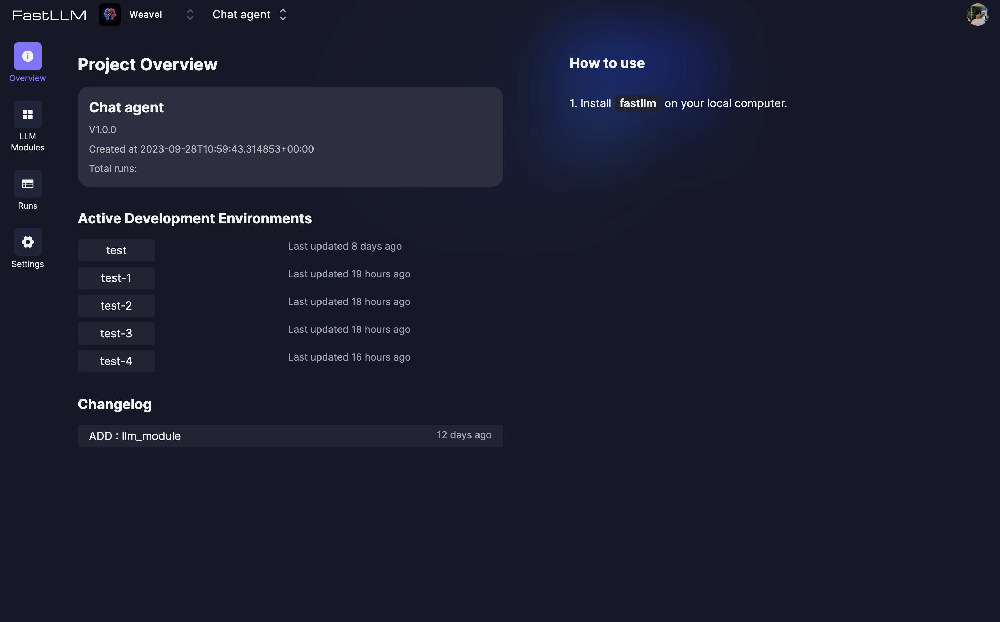
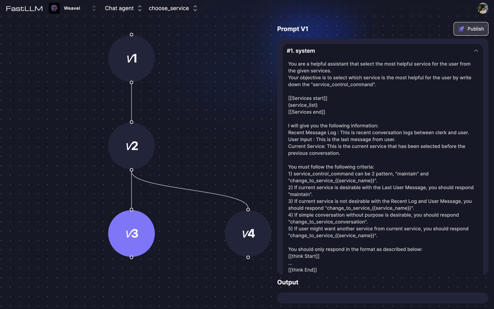

# Quickstart

Integrate **PromptModel** into your project in less than 5 minutes.

To begin, sign up for an account at [https://promptmodel.vercel.app](https://promptmodel.vercel.app/signup).

## Installation

To install `promptmodel` run:

```bash copy
pip install promptmodel
```

## Setup

### CLI Login

```bash copy
prompt login
```

You will be redirected to the PromptModel website for CLI login. After logging in, you can close the browser window and return to your IDE.

### Initialization

```bash copy
prompt init
```

This will generate the following file in the current directory. This file will be used as an entry point for the prompt engineering dashboard.

```python filename="promptmodel_dev.py" copy
"""This single file is needed to build the Client development dashboard."""

from promptmodel import Client

# Example imports
# from <dirname> import < objectname>

app = Client()

# Example usage
# This is needed to integrate your codebase with the prompt engineering dashboard
# app.include(< objectname>)

```

## Code Integration

Now you can use PromptModel in your project.

> PromptModel manages your prompts on the cloud, so you can free your code from `.txt` files or raw strings.

```python copy
from promptmodel import Client, PromptModel

client = Client()

# You can simply fetch prompts
extract_keyword_prompts = PromptModel("extract_keyword").get_prompts()

# Or run PromptModel directly
@client.register
def test():
    response = PromptModel("choose_service").run_and_parse({})
    print(response)
```

## Prompt Engineering

To start engineering your prompts, you can use the **PromptModel CLI (prompt)**.

### Opening the development dashboard

```bash copy
prompt dev
```

This will open the prompt engineering dashboard in your browser. LLM modules will be automatically detected from your code, and displayed in the dashboard. You can now start engineering your prompts.


### Prompt engineering workflow

LLM Module Versions are the core of the prompt engineering workflow. You can create new versions of your LLM modules by clicking the **Create Variant** button in the dashboard.


You can view differences with the previous version while writing your new version, which is a great way to keep track of your changes.


A new prompt version is saved every time you click the **Run** button in the dashboard. Each version is automatically categorized into either `broken` or `working`, depending on whether the run was successful or not. You can evaulate the output, then update the category of the best prompt versions to `candidate`.

### Pushing prompt versions to deployment

Once you have at least one candidate prompt version, you can push the candidates to deployment by clicking the **Push to deployment** button in the dashboard. This will upload the candidate versions to the cloud, and make them available for use in deployment.

You will then be redirected to the deployment dashboard, where you can manage your deployed PromptModels.



## Prompt Management

You can use the deployment dashboard to manage your deployed prompts.

Here you can publish specific prompt versions for use in deployment, create A/B tests (coming soon), and view prompt usage statistics.


